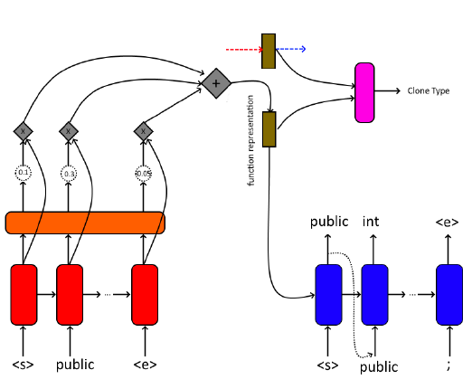
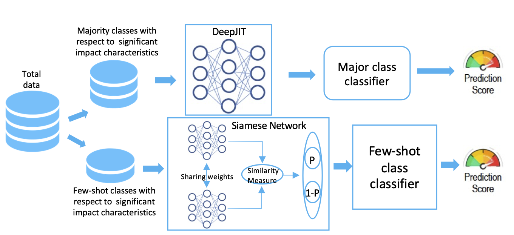

### Selected Projects

* **Code clone detection** 

We investigate whether using representation learning of code snippets can help develop a much more efficient and objective feature vector for codes, which contain the semantic information required for detection of more complex code clones. Feeding possibly long code snippets to a neural network, in a way they can be processed efficiently and understood completely, can be very tricky. For this project, we developed an encoder meant to generate latent representations conditioned on code snippets for the purpose of detecting whether two code snippets are clones. Our results suggest that this approach has considerable potential in detecting code clones.
Read more [here](./files/CS295_Project.pdf)
 

---
* **Software defect prediction bias mitigation** 

Aims: We aim to explore the impact of different commit related characteristic’s imbalance on DL defect prediction. Method: We investigated different characteristic’s impact on the overall performance of DeepJIT and CC2Vec. We also propose a Siamese network based few-shot learning framework for JIT defect prediction (SifterJIT) combining Siamese network and DeepJIT. Results: Our results show that DeepJIT and CC2Vec lose out on the performance by around 20% when trained and tested on imbalanced data. However, SifterJIT can outperform state-of-the-art DL techniques with an average of 8.65% AUC score, 11% precision, and 6% F1-score improvement. Conclusions: Our results highlight that dataset imbalanced in terms of commit characteristics can significantly impact prediction performance, and few-shot learning based techniques can help alleviate the situation. 
 

---

* **Bug report lifetime prediction** 

 

